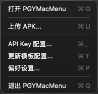
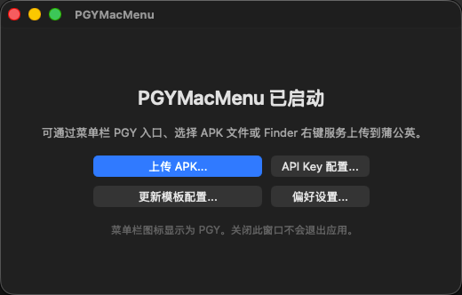
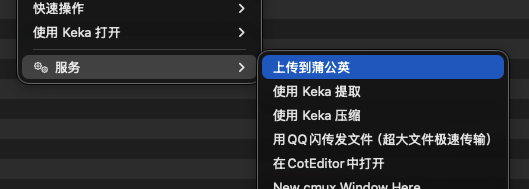
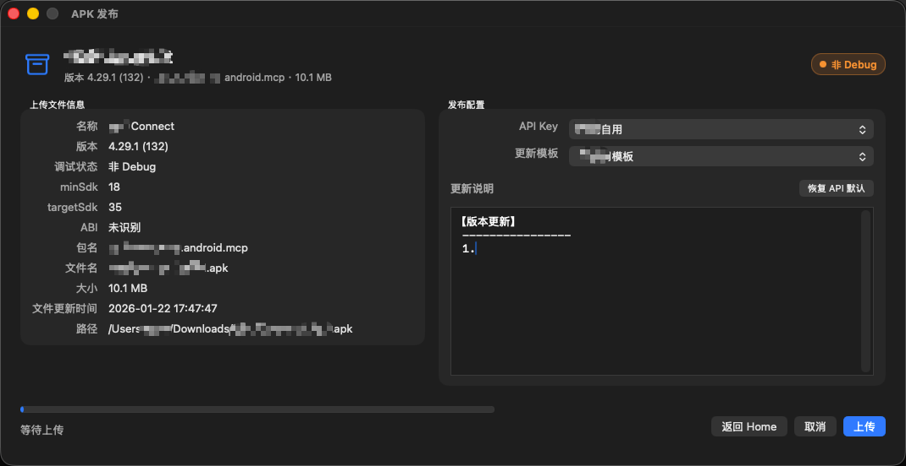
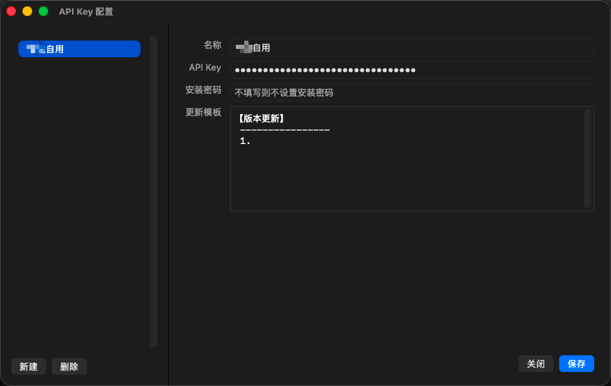
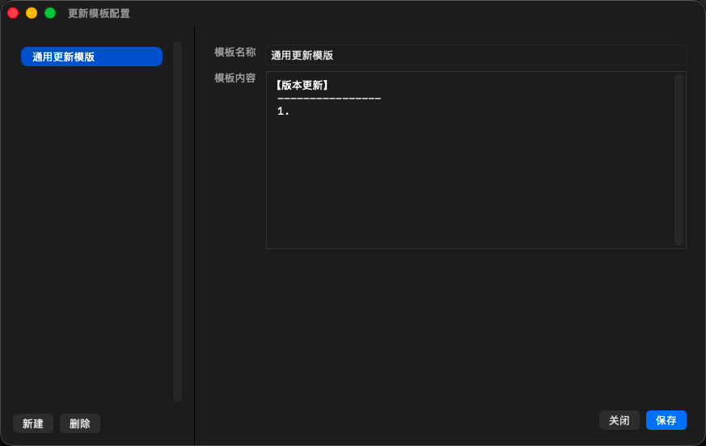

# PGYMacMenu

PGYMacMenu 是一个 macOS 原生工具应用，用于选择 Android APK 并上传到蒲公英。项目采用 Swift + AppKit 实现，支持菜单栏、Finder 右键服务、API Key 配置、更新模板、APK 元信息解析，以及端到端加密的 WebDAV 配置同步。

## 特性

- 上传 APK 到蒲公英：获取上传凭证、上传 APK、轮询发布结果、展示短链和二维码
- 上传前信息确认：展示 APK 名称、包名、版本、SDK、ABI、Debug 状态、文件大小和路径
- 上传成功结果页：展示安装二维码、短链、发布信息、更新说明，并支持复制短链
- Finder 右键入口：选中 `.apk` 文件后可通过服务菜单触发上传
- 菜单栏入口：可上传 APK、打开配置、管理模板和偏好设置
- 多 API Key 配置：支持名称、API Key、安装密码、默认更新说明
- 多更新模板：上传前可快速套用常用发布说明
- WebDAV 加密同步：在多台 Mac 间双向同步 API 配置、密钥、模板和行为偏好
- 重装恢复：同一台 Mac 保留 Keychain 时可自动恢复同步连接和远端配置
- APK 元信息解析工具可配置：支持手动指定 `aapt` 或 Android SDK 路径
- 轻量运行：默认关闭最后一个窗口即退出，可按需开启后台运行和菜单栏图标

## 界面预览

### 菜单栏快捷操作



### 主页面



### Finder 右键服务



### 上传前信息确认



### API Key 配置



### 更新模板配置



## 运行要求

- macOS Sequoia 15.0+
- Apple Silicon Mac 或 Intel Mac
- Xcode Command Line Tools，需包含 `swiftc`、`lipo`、`sips`、`iconutil`、`codesign`
- 可选：Android SDK build-tools 中的 `aapt`，用于解析完整 APK 元信息

## 下载

普通用户可以从 [GitHub Releases](https://github.com/egan-ysk/PGYMacMenu/releases/latest) 下载最新的 `PGYMacMenu-*-macos-universal.zip`。

下载后解压，将 `PGYMacMenu.app` 拖入 `/Applications`，然后打开应用。首次启动时如遇到 macOS 安全提示，可在系统设置的“隐私与安全性”中允许打开。

## 版本更新

### 1.1.0（2026-08-10）

- 新增端到端加密的 WebDAV 双向同步，可同步 API 配置、密钥、更新模板和行为偏好
- 支持保留 Keychain 时卸载重装自动恢复；通过逐记录合并、删除墓碑和强 ETag 条件写入降低多设备覆盖风险
- 新增同步连接测试、手动同步、状态展示和退出前刷新；`aapt` 与 Android SDK 路径仍仅保存在本机
- 新增高清 macOS 应用图标，并在构建时生成完整 `AppIcon.icns` 尺寸集
- 增加 Swift Package 与 XCTest，覆盖合并、加密、WebDAV、迁移恢复和同步状态机
- 强化上传临时文件的本机权限与清理策略

历史版本与安装包见 [GitHub Releases](https://github.com/egan-ysk/PGYMacMenu/releases)。

## 构建

```bash
./scripts/build_app.sh
```

构建完成后产物位于：

```text
dist/PGYMacMenu.app
```

构建脚本会完成：

- 校验 `Info.plist`
- 分别编译 `arm64` 和 `x86_64`
- 使用 `lipo` 生成 universal 可执行文件
- 从 `Resources/AppIconSource.png` 生成十种标准尺寸和 `AppIcon.icns`
- 生成 `.app` Bundle
- 使用 ad-hoc 签名

## 从源码安装

构建后可以直接运行：

```bash
open dist/PGYMacMenu.app
```

也可以复制到系统应用程序目录：

```bash
cp -R dist/PGYMacMenu.app /Applications/
open /Applications/PGYMacMenu.app
```

如果 Finder 右键服务没有立即出现，可以刷新服务菜单：

```bash
/System/Library/CoreServices/pbs -flush
```

然后重新启动应用或重新登录 macOS。

## 使用说明

### 1. 配置 API Key

1. 打开 `PGYMacMenu.app`
2. 进入 `API Key 配置...`
3. 新建配置
4. 填写名称、蒲公英 API Key
5. 可选填写安装密码和默认更新说明
6. 保存

### 2. 配置更新模板

1. 进入 `更新模板配置...`
2. 新建模板
3. 填写模板名称和模板内容
4. 保存

### 3. 配置 APK 解析工具

进入 `偏好设置...`，可手动配置：

- `aapt` 可执行文件路径
- Android SDK 目录

`aapt` 常见路径：

```text
~/Library/Android/sdk/build-tools/<version>/aapt
```

如果未配置，应用会尝试从 `ANDROID_HOME`、`ANDROID_SDK_ROOT` 和常见 SDK 目录自动查找。

### 4. 配置 WebDAV 同步

进入 `偏好设置...` 的 `同步` 标签页，填写：

- HTTPS WebDAV 根 URL
- 远端相对文件路径，默认 `PGYMacMenu.sync`
- WebDAV 用户名和密码
- 至少 12 个字符的独立同步口令，并再次确认

先点击 `测试连接` 验证读写权限和强 ETag 支持，再保存同步设置。保存后同步自动启用，可使用 `立即同步` 手动触发安全的双向合并。

同步范围包括 API Key 配置及其 API Key/安装密码、更新模板，以及后台运行、菜单栏图标和上传成功后退出这三项行为偏好。`aapt` 和 Android SDK 路径属于设备本地设置，不会同步。

### 5. 上传 APK

上传入口有三种：

- 主页面点击 `选择 APK...`
- 菜单栏 `PGY` 图标中选择 `上传 APK...`
- Finder 中右键 `.apk` 文件，选择 `上传到蒲公英`

上传流程：

1. 选择 APK
2. 检查上传前信息
3. 选择 API Key 和更新模板
4. 点击上传
5. 在确认 sheet 中确认目标配置和更新说明
6. 等待上传与发布完成
7. 查看短链和二维码

## 配置与安全

- API Key、安装密码、WebDAV 凭据和同步口令保存在 macOS Keychain
- 本地配置使用版本化 manifest；敏感字段不会写入明文 `UserDefaults`
- 远端同步文件使用 PBKDF2-HMAC-SHA256（600,000 次）派生密钥，并以 AES-256-GCM 加密和认证
- 应用只连接系统信任证书的 HTTPS WebDAV 服务；条件写入要求服务端提供强 ETag
- 多设备对同一数据集逐记录合并，并保留删除墓碑，避免离线设备恢复已删除项目
- 应用不会在工程目录或构建产物中写入 API Key、安装密码或同步凭据，应用自身也不会主动记录这些值
- 上传请求使用 `URLSessionConfiguration.ephemeral`，避免 URLSession 磁盘缓存
- APK 上传时使用专属 `0700` 临时目录和 `0600` multipart 文件，不把 APK 整体读入内存；完成、失败或检测到崩溃残留时会清理
- [蒲公英 `buildInfo` 官方接口](https://www.pgyer.com/doc/view/api_upload) 要求通过 HTTPS GET 参数提交 API Key 与 Build Key；应用不会记录完整请求 URL，但这些值仍会按协议发送给蒲公英服务端

同一台 Mac 卸载重装后，如果系统 Keychain 仍保留，应用可自动找回 WebDAV 连接并恢复配置。换新 Mac 或清空 Keychain 后，需要重新输入 WebDAV 信息和原同步口令。同步口令无法找回；丢失后不能解密既有远端备份。

## 项目结构

```text
Sources/PGYMacMenu/
  AppDelegate.swift                    应用生命周期、菜单栏、Finder 服务、文件入口
  Models.swift                         配置模型、APK 信息、蒲公英响应模型
  ConfigurationStore.swift             版本化本地配置、迁移与变更事件
  KeychainStore.swift                  Keychain 封装
  SyncModels.swift                     HLC、版本化同步记录与确定性合并
  SyncCrypto.swift                     PBKDF2、AES-GCM 信封与内容哈希
  WebDAVClient.swift                   HTTPS WebDAV、强 ETag 与条件写入
  SyncCoordinator.swift                双向同步状态机、变更排队与退出刷新
  ApkMetadataReader.swift              APK 元信息解析
  PgyerClient.swift                    蒲公英上传与发布轮询
  HomeWindowController.swift           主页面
  UploadWindowController.swift         上传前信息、确认 sheet、上传进度
  ResultWindowController.swift         上传成功结果页与二维码
  APIKeySettingsWindowController.swift API Key 配置
  TemplateSettingsWindowController.swift 更新模板配置
  PreferencesWindowController.swift    偏好设置
  UIHelpers.swift                      AppKit UI 工具方法
Resources/
  AppIconSource.png                    1024×1024 sRGB 应用图标母版
  Info.plist                           Bundle、UTType、Finder Services 配置
Tests/PGYMacMenuTests/                 合并、加密、WebDAV 与状态机测试
Package.swift                          Swift Package 与 XCTest 入口
scripts/
  generate_app_icon.swift              可重复生成 1024x1024 sRGB 图标母版
  build_app.sh                         构建脚本
docs/
  app-design.md                        应用设计文档
  user-guide.md                        软件使用说明
```

## 开发说明

项目不依赖第三方库，直接使用系统框架：

- AppKit
- CommonCrypto
- CryptoKit
- Foundation
- Security
- UniformTypeIdentifiers
- CoreImage

可运行测试：

```bash
swift test
```

构建产物会生成到 `.build/`、`build/` 和 `dist/`，这些目录默认不纳入 Git 版本控制。

需要重新生成应用图标母版时运行：

```bash
swift scripts/generate_app_icon.swift Resources/AppIconSource.png
```

## 文档

- [应用设计文档](docs/app-design.md)
- [软件使用说明](docs/user-guide.md)
- [安全策略](SECURITY.md)

## 开源协议

本项目基于 [MIT License](LICENSE) 开源。
